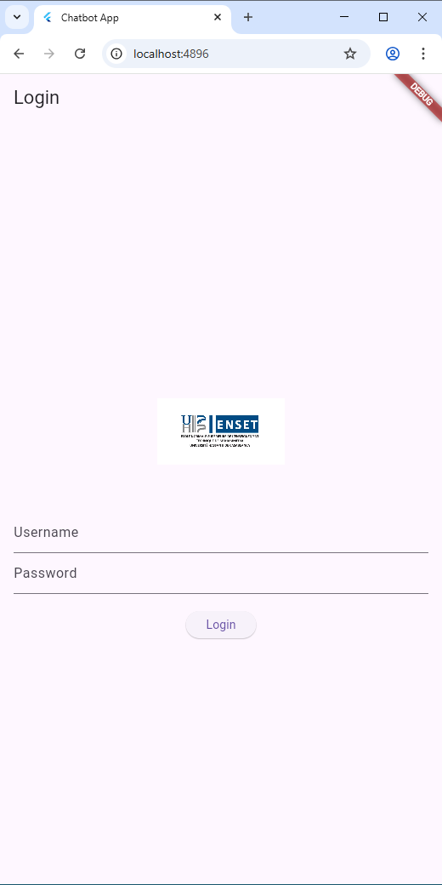
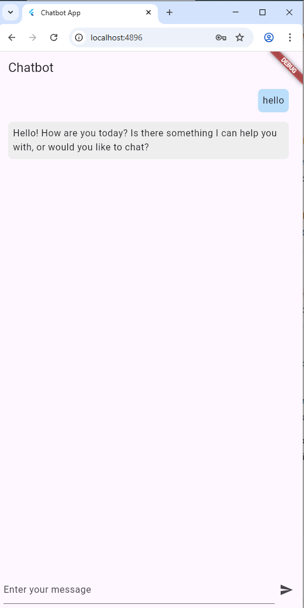

# Chatbot Flutter

## Description
Ce projet est une application mobile cross-platform développée avec Flutter. Elle permet de créer un chatbot interactif qui communique avec un modèle de langage (LLM). L'application comprend deux écrans principaux :
- **Écran d'authentification** : Permet à l'utilisateur de se connecter avec un nom d'utilisateur et un mot de passe.
- **Écran de chat** : Permet d'envoyer des messages au chatbot et de recevoir des réponses.

## Fonctionnalités
- Connexion simple avec un nom d'utilisateur et un mot de passe (non vide).
- Interface de chat intuitive pour interagir avec le chatbot.
- Gestion de l'état avec le pattern **BLoC** pour séparer la logique d'interface et la logique applicative.
- Affichage d'un logo sur l'écran de connexion.

## API Utilisée
Initialement, l'application utilisait l'API d'OpenAI avec une clé API (`xksksk-sdfdsfd0dsfsdf-sdfsdfds`). Cependant, cette clé s'est révélée invalide et ne fonctionnait pas. Par conséquent, l'application a été modifiée pour utiliser l'API de **console.groq.com**, qui fournit des réponses pour le chatbot.

## Prérequis
- Flutter SDK installé.
- Une clé API valide de `console.groq.com` pour activer les fonctionnalités du chatbot.

## Installation
1. Clonez le projet :
   ```bash
   git clone <url-du-repo>
   ```
2. Accédez au dossier du projet :
   ```bash
   cd chatbot_counter_app
   ```
3. Installez les dépendances :
   ```bash
   flutter pub get
   ```
4. Configurez la clé API dans `lib/bloc/chat_bloc.dart` :
   ```dart
   final String apiKey = 'votre-clé-api-groq';
   ```
5. Lancez l'application :
   ```bash
   flutter run
   ```

## Captures d'écran
- **Écran d'authentification** : Affiche un logo centré en haut, suivi de deux champs de texte pour le nom d'utilisateur et le mot de passe, et un bouton de connexion. Le logo est chargé depuis `assets/logo.png`.  
  
- **Écran de chat** : Montre une liste de messages avec les messages de l'utilisateur à droite (en bleu) et les réponses du chatbot à gauche (en gris). En bas, un champ de texte permet d'envoyer des messages avec un bouton d'envoi. 
  

## Remarque
Assurez-vous que la clé API de `console.groq.com` est valide et que votre connexion Internet est active pour permettre les appels API.